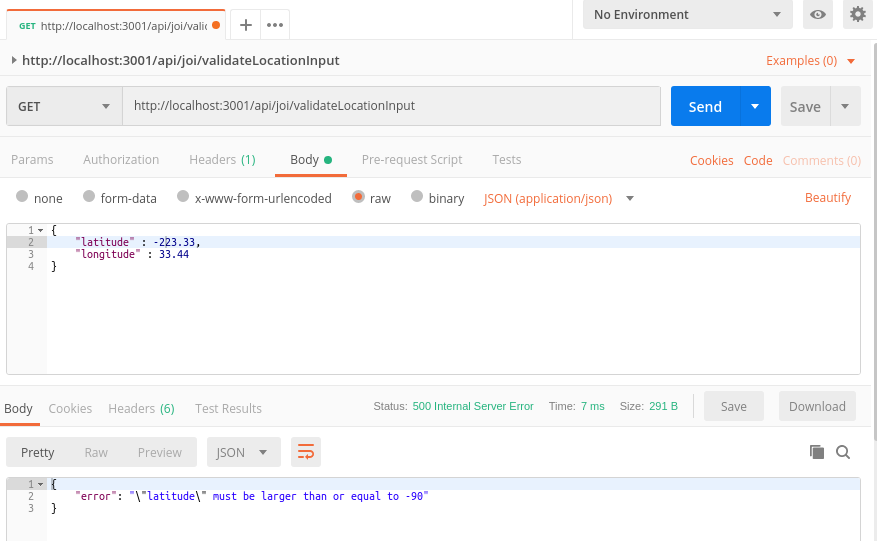
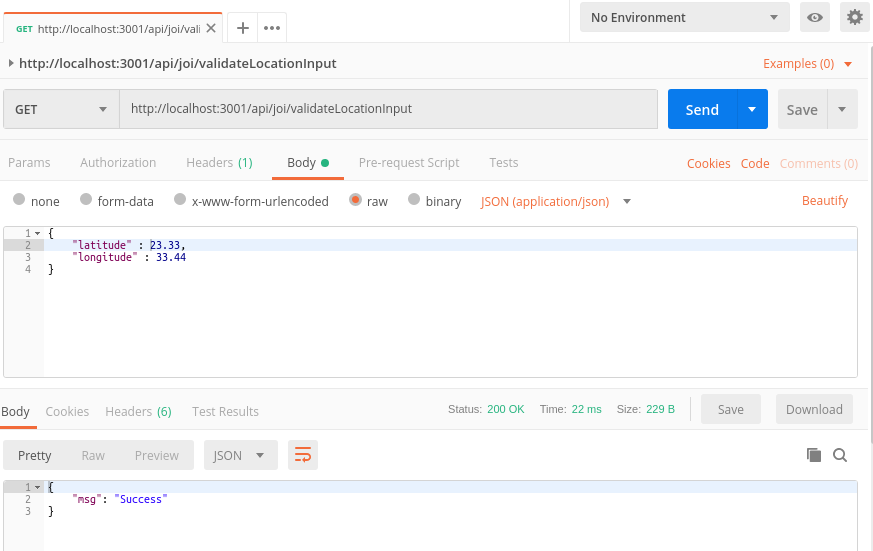

# Simple-Joi-Validator
A Sample Node JS Server With Joi Validation for Various Input Types

# Getting Started

Make sure you have installed Node JS, then

1) Clone the Repository :
git clone https://github.com/karthicksanjeevi/Simple-Joi-Validator.git
2) Move inside the project folder :
cd Simple-Joi-Validator
3) Install the necessary packages :
npm install
4) Run the Node JS server :
npm start

# How to Test ?

We can test these API's using Postman [https://www.getpostman.com/]. Please download and install the software and you will get a tons of guide on how to use it.

Attaching sample screenshots of response from Postman when hitting our API's with expected input and wrong input.

## Error Scenario

## Expected Scenario

